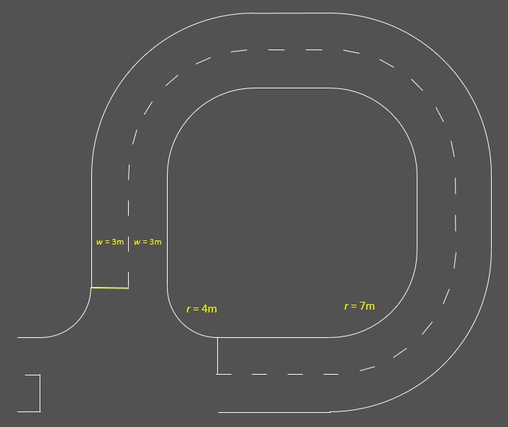
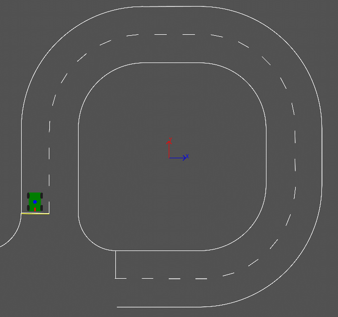
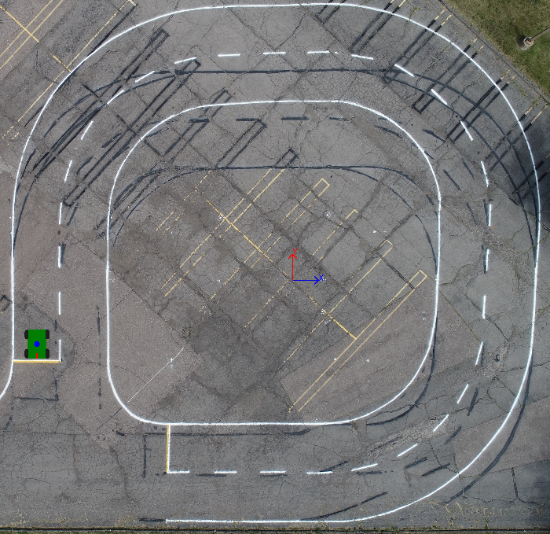
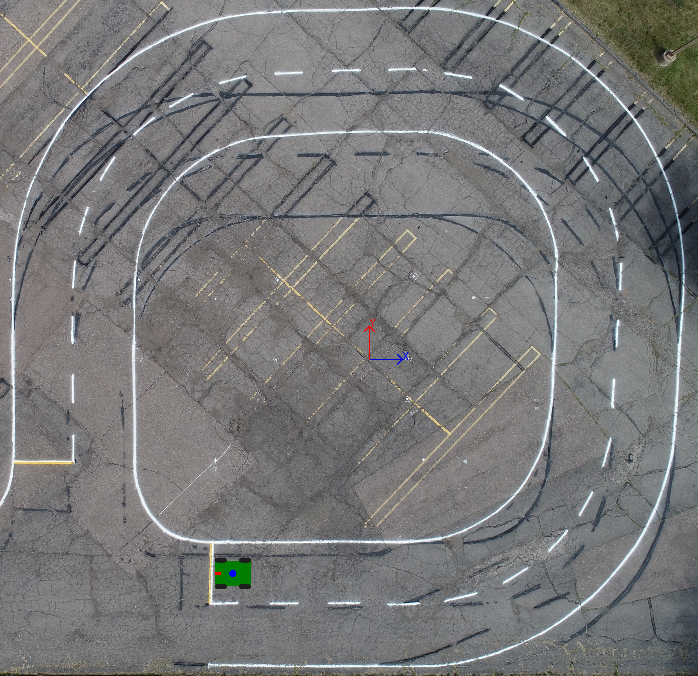

# `simple_sim_h_course` (The test course Lot H)

Lane width and radii of the `simple_sim` simulation enviornment for Lot H Test Course
<br>

<br><br>
To launch the following course with a vehicle facing south:
```
$ roslaunch simple_sim_h_course h_course.launch
```

<br><br>
To launch the following drone picured course with a vehicle facing south:

```
$ roslaunch simple_sim_h_course h2_course.launch
```


<br><br>
To launch the following drone picured course with a vehicle facing west:

```
$ roslaunch simple_sim_h_course h2in_course.launch
```
